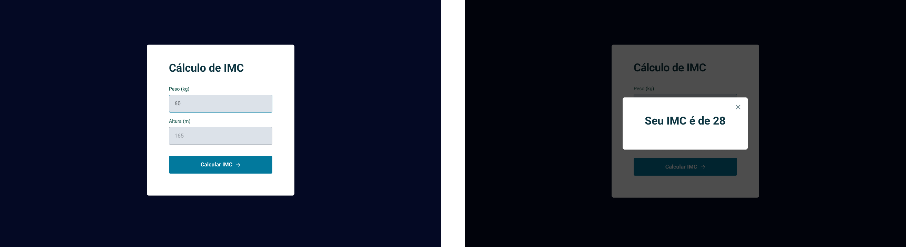

# [IMC Calculation](https://igorsilvam.github.io/imc-calculation)

This project aims to put JavaScript, HTML and CSS into practice, where a BMI (Body Mass Index) calculator was created to know if you are healthy or out of range, JavaScript modules were used, it was created in the Rocketseat's Explorer program.

## Tech Stack

## Usage

To use this project, go to the link:

[Link Project](https://igorsilvam.github.io/imc-calculation)

## Contact

Made with ❤️ by [Igor Silva](https://github.com/igorsilvam), get in touch!

&nbsp;

